  

# 👋 Hi, I'm **Jayesh Pandya**  

🚀 **Aspiring Software Engineer | System Software Enthusiast | Problem Solver**  

Welcome to my GitHub profile! I'm passionate about working on challenging projects and exploring the intersection of hardware and software.

---

## 🌟 **About Me**
<!-- - 🔭 I have experience with **distributed systems**, **VLSI fault simulation**, and **network performance analysis**. -->
- 💻 Proficient in **C**, and **C++**, with a strong foundation in **data structures**, **algorithms**, and **OOP concepts**.
- 🔍 I enjoy solving problems related to **DSA**,**DBMS**, **operating systems**, and **networking**.
<!-- - 🛠️ Learning and experimenting with **device drivers in C** and exploring **system-level programming**.
- 🌐 Contributor to academic projects that bridge software with hardware performance. -->

---

## 🏗️ **My Projects**
### 🔹 [Distributed Banking System](https://github.com/PandyaJayesh/Distributed_Banking)
- Built a distributed banking system with **fault tolerance** and **Lamport clocks** for event ordering.
- Used locking mechanisms to prevent race conditions and ensured reliable transactions.

### 🔹 [Simple File System](https://github.com/PandyaJayesh/Simple_File_System)
- Implemented a basic file system in **C** supporting file and directory operations.

### 🔹 TCP Variants in Wireless Networks
- Compared TCP variants in wireless networks using **ns-3** for performance analysis.

### 🔹 Concurrent Fault Simulation in VLSI
- Simulated concurrent faults in VLSI testing using **Cadence EDA tools**.

---

## 🛠️ **Skills**
### Programming
- **Languages**: C, C++, JavaScripts(Basics)
- **Concepts**: Data Structures, Algorithms, OOP
- **Tools**: Git, PostgreSQL, PgAdmin, MATLAB

### Systems and Tools
- **Networking**: OpenMPI, TCP/IP Protocols
- **Simulators**: NetSim Academic

---

<!-- ## 💡 **What I'm Currently Learning**
- 🌱 **Device Drivers in C** for system-level programming.
- 📚 Diving deeper into **wireless networking protocols** and **TCP optimization**.
- 🛠️ **Automation techniques** for system setups and testing.

--- -->

## 📫 **Connect with Me**
- 💼 LinkedIn: [jayesh pandya](https://www.linkedin.com/in/jayesh-pandya-ab334b28a)
<!-- - 🌐 Portfolio: [jayeshpandya.github.io](#) (Coming Soon!) -->

---

## ⚡ **GitHub Stats**

  

  

---

Thank you for visiting my profile! 🚀  
Feel free to reach out if you'd like to collaborate or discuss any exciting projects!
